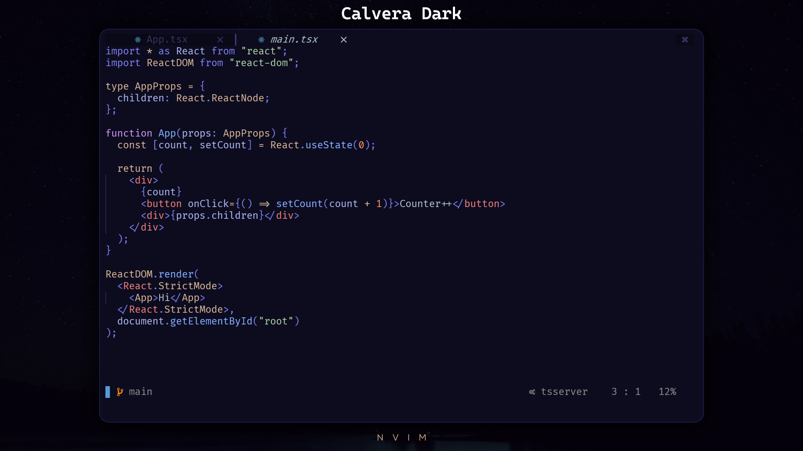

#  Calvera Dark.nvim


## Installation

Install via your favorite package manager:
```vim
" If you are using Vim-Plug
Plug 'yashguptaz/calvera-dark.nvim'
```

```lua
-- If you are using Packer
use 'yashguptaz/calvera-dark.nvim'
```

Requirements: Neovim 0.5

## 🌌 Usage

Enable the color scheme:
```vim
"Vim-Script:
-- Optional Settings 
let g:calvera_italic_comments = 1
let g:calvera_italic_keywords = 1
let g:calvera_italic_functions = 1
let g:calvera_contrast = 1

-- Required
colorscheme calvera
```

```lua
--Lua:

-- Optional Example Configuration
vim.g.calvera_italic_keywords = false
vim.g.calvera_borders = true
vim.g.calvera_contrast = true
vim.g.calvera_hide_eob = true
vim.g.calvera_custom_colors = {contrast = "#0f111a"}

-- Required Setting
require('calvera').set()
```

For more optional settings see the [Options Section](#options)
Note: The order matters, make sure to place the optional configuration
above the initialization.

## Info

Calvera Dark is a modern and blazing fast Neovim theme.

A port of [Calvera Dark](https://github.com/saurabhdaware/vscode-calvera-dark) colorscheme for Neovim written in Lua.

## ✨ Features
+ Supported plugins:
    + [TreeSitter](https://github.com/nvim-treesitter/nvim-treesitter)
    + [LSP Diagnostics](https://neovim.io/doc/user/lsp.html)
    + [Lsp Saga](https://github.com/glepnir/lspsaga.nvim)
    + [Nvim-Compe](https://github.com/hrsh7th/nvim-compe)
    + [LSP Trouble](https://github.com/folke/lsp-trouble.nvim)
    + [Git Gutter](https://github.com/airblade/vim-gitgutter)
    + [git-messenger](https://github.com/rhysd/git-messenger.vim)
    + [Git Signs](https://github.com/lewis6991/gitsigns.nvim)
    + [Telescope.nvim](https://github.com/nvim-telescope/telescope.nvim)
    + [Nvim-Tree.lua](https://github.com/kyazdani42/nvim-tree.lua)
    + [NERDTree](https://github.com/preservim/nerdtree)
    + [Indent-Blankline.nvim](https://github.com/lukas-reineke/indent-blankline.nvim)
    + [vim-which-key](https://github.com/liuchengxu/vim-which-key)
    + [WhichKey.nvim](https://github.com/folke/which-key.nvim)
    + [Dashboard](https://github.com/glepnir/dashboard-nvim)
    + [BufferLine](https://github.com/akinsho/nvim-bufferline.lua)
    + [Lualine](https://github.com/hoob3rt/lualine.nvim)
    + [Neogit](https://github.com/TimUntersberger/neogit)
    + [vim-sneak](https://github.com/justinmk/vim-sneak)
    + [nvim-dap](https://github.com/mfussenegger/nvim-dap)
    + [vim-illuminate](https://github.com/RRethy/vim-illuminate)

+ Ability to change background on sidebar-like windows like Nvim-Tree, Packer, terminal etc.

+ Asynchronous highlight loading which makes the theme extremely fast

+ Lualine

To enable the `calvera-nvim` theme for `Lualine`, simply specify it in your lualine settings:
( make sure to set the theme to 'calvera-nvim', as 'calvera' already exists built in to lualine)

```lua
require('lualine').setup {
  options = {
    -- ... your lualine config
    theme = 'calvera-nvim'
    -- ... your lualine config
  }
}
```

## Options

| Option                              | Default     | Description                                                                                      |
| ----------------------------------- | ----------- | ------------------------------------------------------------------------------------------------ |
| calvera_contrast                    | `true`      | Make sidebars and popup menus like nvim-tree and telescope have a different background           |
| calvera_lighter_contrast            | `false`     | Increase the contrast for the 'lighter' variant of the theme                                     |
| calvera_italic_comments             | `false`     | Make comments italic                                                                             |
| calvera_italic_keywords             | `false`     | Make keywords like if, for, while etc. italic                                                    |
| calvera_italic_functions            | `false`     | Make function calls and names italic                                                             |
| calvera_italic_variables            | `false`     | Make variable names and identifiers italic                                                       |
| calvera_borders                     | `false`     | Enable the border between verticaly split windows visable                                        |
| calvera_disable_background          | `false`     | Disable the setting of background color so that NeoVim can use your terminal background          |
| calvera_hide_eob                    | `false`     | Hide the end of buffer lines ( ~ )                                                               |
| calvera_variable_color              | `#717CB4`   | Set a custom color for variables and fields                                                      |
| calvera_custom_colors               |    {}       | Override the default colors and use your own                                                     |
| calvera_transparent_bg               | `false`     | Transparent Background                                                                           |


```lua
-- Example config in lua
vim.g.calvera_italic_comments = true
vim.g.calvera_italic_keywords = true
vim.g.calvera_italic_functions = true
vim.g.calvera_italic_variables = false
vim.g.calvera_contrast = true
vim.g.calvera_borders = false
vim.g.calvera_disable_background = false
vim.g.transparent_bg = true
--vim.g.calvera_custom_colors = { black = "#000000", bg = "#0F111A" }

-- Load the colorscheme
require('calvera').set()
```


```vim
" Example config in Vim-Script
let g:calvera_italic_comments = 1
let g:calvera_italic_keywords = 1
let g:calvera_italic_functions = 1
let g:calvera_contrast = 1

" Load the colorsheme
colorscheme calvera
```

## Functions

+ Toggle the end of buffer lines ( ~ )


Call the built in function for toggling buffer lines

```vim
"Vim-Script
:lua require('calvera.functions').toggle_eob()
"This command toggles the end of buffer lines
```


The command can also be mapped to a key to toggle the lines live
```vim
"Vim-Script:
nnoremap <leader>me :lua require('calvera.functions').toggle_eob()<CR>
```


```lua
--Lua:
vim.api.nvim_set_keymap('n', '<leader>me', [[<Cmd>lua require('calvera.functions').toggle_eob()<CR>]], { noremap = true, silent = true })
```

## Development

In the plugin folder use the command below to open neovim

```
nvim --cmd "set rtp+=."
```

Source the `dev/dev.lua` file with the command `:luafile %` every time you make a change. 

## Acknowledgement

[Material.nvim](https://github.com/marko-cerovac/material.nvim) - Material.nvim was used as a starting point for this color theme.

[VSCode Calvera Dark](https://github.com/saurabhdaware/vscode-calvera-dark) - VSCode Calvera Dark was used to pick the colors
